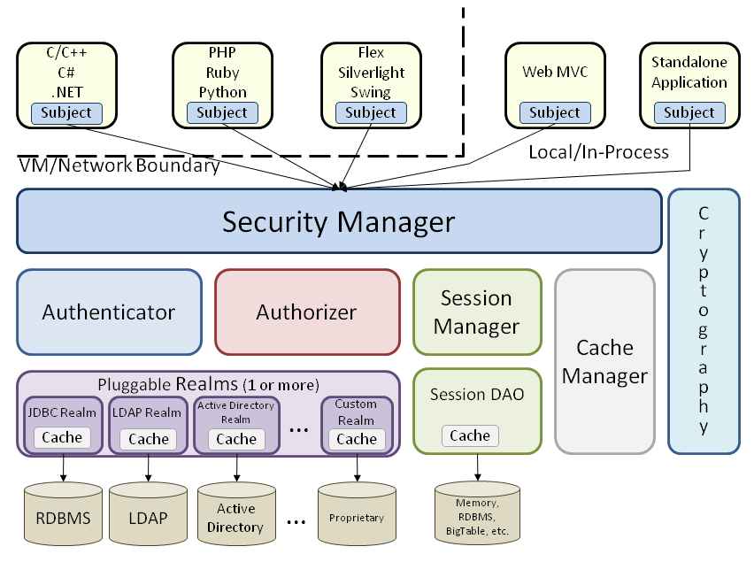

**Table of Content**
- [Introduction](#introduction)
- [Project Purpose](#project-purpose)
- [Project Scope](#project-scope)
- [Current system](#current-system)
- [Proposed system](#proposed-system)
- [Functional Requirements](#functional-requirements)
- [System Design](#system-design)
  - [Use Case Diagram](#use-case-diagram)
  - [Sequence Diagram](#sequence-diagram)
  - [Data Flow Diagram](#data-flow-diagram)
  - [System Architecture](#system-architecture)
  - [Apache Shiro Architecture](#apache-shiro-architecture)
- [References](#references)

# Introduction
Due to the evolution of the internet, cloud applications have become the mainstream for every computer user. Although local programs are still being used to some extent, cloud-based web applications have demonstrated their capabilities over traditional programs and shaped the future of computer usage. Cloud computing has offered better hardware acceptability and utilization, immersive user collaboration, and advanced technical support. All of which have increased the demand for developing cloud solutions. As attractive as these solutions sound, they can't be accomplished without facing complex challenges and technical difficulties. Diligently, software engineers have defined design patterns that aim to address occurring problem areas in cloud application development.

# Project Purpose
The purpose of this project is to tackle two popular obstacles in cloud application development. The first one is application performance. The responsiveness of a system to execute any action within a given time interval is very essential. Achieving an acceptable performance level is quite challenging knowing that several technical aspects can form bottlenecks in cloud performance. The second major problem area is cloud security. Cloud applications should prevent malicious activities, data disclosures, and unauthorized access. The designed project should deliver a decent performance level while maintaining the highest security.

# Project Scope
The scope of this project is defined by two design patterns in cloud computing. The first one is related to system performance and known as Static Content Hosting. This pattern aims to deploy static content to a cloud-based storage service that is separated from the actual web application. While the web application will be handling dynamic code execution and database querying, the static data will be served independently to the client.  can reduce the computational cost, therefore, enhance the system responsivity.

The main consideration when implementing this pattern is to secure the private resources from being accessed by anonymous users. To fulfill the previously mentioned requirement a security-related design pattern called Valet Key will be implemented. This pattern employs tokens or keys to provide time/role limited direct access to the static content. The nature of the separation between a web application and a storage service makes the latter unable to authorize valid users and authenticate their requests. For this reason, tokens will be issued and sent to the client then can be used as a proof of legitimacy, to fetch the required resources. 

# Current system
The current system can be described as a simple unsophisticated web application that is responsible for both static and dynamic hosting. This application performs computations to query a database and populate dynamic results. Also, it handles requests to download and upload static content. This application has neither authentication nor authorization mechanism. All of its endpoints are publicly exposed and can be access with no restrictions.

# Proposed system
The system will consist of a Java web application that has an Apache Shiro authentication manager which is hosted on a Tomcat server with Apache portable runtime extension. The system will have public endpoints for guests and protected endpoints for the application’s users. Apache Shiro will authenticate users and provide access control mechanism. Tomcat APR will host static content and serve them to the client directly without the interfering of the web application. The web application will run the business logic, query data, and render dynamic responses.

# Functional Requirements

**Login:**

The users should be authenticated based on their provided credentials. A secure session should be established authorizing the validated users to access certain endpoints based on their privileges. 

**Fetch static resources:**

The users should be able to fetch static files such as images according to their given authorization. 
 

**Access Application endpoints:** 

Guests should be able to navigate to public web pages while authenticated users can access both public and private web pages.

**Logout:**
The users should be able to destroy their authorization session at any time in order to prevent guests from accessing their protected data.

# System Design

## Use Case Diagram

## Sequence Diagram

## Data Flow Diagram

## System Architecture

## Apache Shiro Architecture

# References

**Research Papers:**

* [A Study of Bare PC Web Server Performance for Workloads with Dynamic and Static Content](https://ieeexplore.ieee.org/document/5167034)

* [Security Mechanism for Packaged Web Applications](https://ieeexplore.ieee.org/document/8029814)

* [A Priority-Based Dynamic Web Requests Scheduling for Web Servers over Content- Centric Networking](https://ieeexplore.ieee.org/document/7372281)

* [Static and dynamic scheduling algorithms for scalable Web server farm](https://ieeexplore.ieee.org/document/905064)

* [A survey on client side and server-side approaches to secure web applications](https://ieeexplore.ieee.org/document/8203685)

**Note:** All implementation resources are included in the presentation [slides](docs/Presentation 3.pdf).